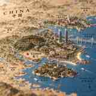

# City Diorama Map Skill

把任意城市转换为“复古纸质地图 + 3D 地形浮雕 + 城市微缩沙盘 + 移轴微距摄影”风格的高质量图像生成提示词。

## 风格预览

### 厦门基础风格版



复古纸质地图、海岛城市、鼓浪屿、厦门大学、南普陀寺、双子塔、移轴微缩沙盘感。

### 厦门基础设施强化版


在同一视觉体系中强化高崎机场、翔安机场、港口、跨海桥、渡轮与城市交通结构。

> 目标不是普通平面地图，也不是普通城市航拍，而是 **复古纸质地图 + 立体地形 + 城市微缩沙盘 + 移轴微距摄影** 的组合。

## 快速使用

直接输入：

```text
做一个厦门的立体纸上地图，要体现鼓浪屿、厦门大学、南普陀寺、双子塔、高崎机场、翔安机场、港口和跨海桥。
```

Skill 会自动：

- 识别城市类型与自然地理特征
- 补足代表性地标与基础设施
- 组织前 / 中 / 后景构图
- 生成中英双语地图标注
- 固定复古纸图、微缩沙盘、移轴摄影视觉语言
- 根据需求切换旅游、基础设施、电影感模式

## 目录

```text
city-diorama-map-skill/
├── README.md
├── SKILL.md
├── prompts/
│   ├── base-prompt.md
│   ├── negative-prompt.md
│   ├── tourism-mode.md
│   ├── infrastructure-mode.md
│   └── cinematic-mode.md
├── examples/
│   ├── xiamen.md
│   ├── beijing.md
│   ├── shanghai.md
│   └── chongqing.md
├── references/
│   └── style-guide.md
└── assets/
    ├── README.md
    ├── xiamen-style-reference.svg
    └── xiamen-infrastructure-reference.svg
```

## 核心视觉关键词

`vintage cartographic map` · `3D topographic relief map` · `miniature city diorama` · `architectural scale model` · `museum-quality handcrafted model` · `tilt-shift photography` · `macro photography` · `shallow depth of field` · `warm cinematic daylight` · `realistic paper texture`

## 设计原则

这不是严格 GIS 制图。默认保留真实地理关系，但允许为了视觉表现适度压缩地标间距；当用户要求“真实比例 / GIS 准确”时，才优先地理准确性。

## 示例

- `做一个重庆版，重点体现山城、长江、嘉陵江和跨江桥。`
- `做一个上海版，机场和港口要明显。`
- `做一个成都版，突出双机场、天府新区和城市绿地。`

详见 [`SKILL.md`](./SKILL.md)。
